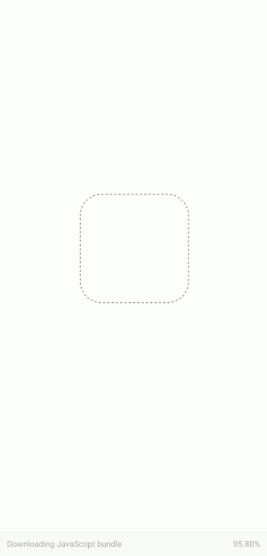

# Facebook Like Placeholder Loading in React Native

> Using Placeholder Loaders in React Native apps using rn-placeholder



## Clone the repo

```bash
$ git clone https://github.com/vikrantnegi/react-native-placeholder-loading
```

## Install the dependencies

```bash
$ yarn
```

## Run the app

```bash
$ yarn start
```

Press i to run the iOS Simulator. This will automatically run the iOS Simulator even if it's not opened.

Press a to run the Android Emulator. Note that the emulator must be installed and started already before typing a otherwise it will throw an error in the terminal.

You can also run the app in your device by installing expo app from the app store and then scanning the QR code.

## License

MIT © [Vikrant Negi](https://github.com/vikrantnegi)
